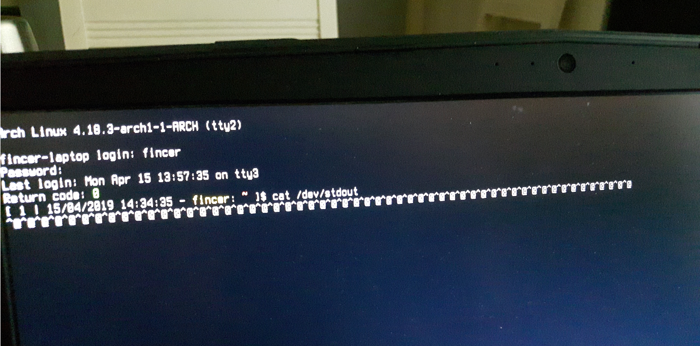

## Real life case: Hostile Linux rootkit on my system. How did I get infected by a real Linux rootkit first time in my life?

TL;DR; By running `libvirtd` background process as root. Please, don't.

### My experience: Infected Arch Linux KVM hypervisor 

So, after long 9 years of Linux experience, administration and usage, it has to happen to me. I have secured many of my systems, but didn't consider `libvirtd` process to become a sneaky one. I have [virt-manager (Virtual Machine Manager)](https://en.wikipedia.org/wiki/Virtual_Machine_Manager), which I use**d** to run QEMU KVM instances using `libvirtd` _system_ process by default. However, not anymore. Let me explain.

For those, who don't know: `libvirtd` stands for _libvirt virtualization management system, server side daemon_ ([website](https://libvirt.org/))

And ugh, these obfuscated terms. Let's cut the crap. `libvirtd`/`QEMU` _system_ process? Well, to speak, it means that every time you launch a QEMU virtual machine on [virt-manager](https://en.wikipedia.org/wiki/Virtual_Machine_Manager) GUI, you call `libvirtd` process which is run in the background as... `root`! Cool and secure, isn't it?

So what was my ultimate mistake? I did open a QEMU instance from `virt-manager` using `libvirtd` _system_ process, being a stupid and novice idiot. On that QEMU virtual machine, I did some security-related research as _non-root user_ and opened a malicious website, and then... BOOM. I had KDE 5 Dolphin file manager & VLC media player running on the host OS at the moment, and every time I tried open a file using these programs, they just... hang. After a while, I stopped that malicious QEMU virtual machine, and figured out something is not right on my hypervisor Arch Linux host system.

Right now, someone could say: YOUR FAULT! Yes, it is. Or drop the network (physically), and do some RAM/memory analysis, stay calm. Correct answer, maybe. I trusted my hardened 5.5 year old Arch Linux system too much, so I didn't expect this to be possible in the first place. So, I ignored some recovery principles some experts suggest to a situation like this, and rebooted my system.

After the reboot, I opened a new TTY (shell/CLI). Even before logging in, I found out that something fancy was going on. Whitepace characters, appearing from nowhere at regular 1 second intervals, automatically being printed on /dev/stdout (STDOUT):

_Well, this is something new I have never seen in the last 9 years. You definitely don't want this running on your company's production or server systems, do you?_

These `^@^@`. Appearing from...where? That was my question. At this point, my system was already disconnected from network. I did some basic investigation on the system, until I realized that rootkits can hide themselves from process & kernel modules lists, opened network sockets list, and basically, from everywhere on a running system. So to speak: say goodbye to any basic `lsmod`, `ps`, `strace`,`netstat`... commands. Checking `/proc` folder directly may be useless, too. These tools...they won't help you.

I did basic rootkit lookup with basic tools such as `rkhunter` (already had my suspicions that this is not going to work but did it anyway). I did timestamp and recursive analysis on all files in non-running Arch Linux system from a live-USB Linux, and found out nothing. I re-installed a bunch of packages (including `glib`, `linux` (kernel), `gcc`...), using locally obtained `tar.xz` packages from trusted remote sources, and the "problem" disappeared for a while, until `^@^@` stuff began to pop up again on my screen. Fuck that shit, that was my first thought.

At this point, I decided it was time to say goodbye to that Arch Linux system. So I nuked it, destroyed MBR (master boot record) and every bit I had on the system. I have a NVMe drive, so I secure-erased it and checked `hexdump` results. I re-installed and re-configured Arch Linux system components directly to a SDHC card, from which I dropped all the system data to secure-formatted NVMe drive after all. So, basically, I reinstalled everything from scratch, from trusted sources only.

And those fancy `^@^@` characters never appeared again.

### How long did it take to recover?

TL;DR; 3-4 _very, very_ intensive days. And remember: only one system. Got bunch of these systems on a company's network, you'd be fucked. I don't want to be that guy solving that hassle. Please, take simple security steps and avoid this situation as much as you can.

### My mistakes

I understand several basic facts here:

- **Mistake 1.** Misconfigured KVM hypervisor. `QEMU` processes and `libvirtd` requires much more attention and configuration steps than running basic Oracle VirtualBox VM instances. Afterwards, I learned that you can run QEMU KVM instances using _session_ mode, which is absolutely the one I will use from this day. Still checking whether `libvirtd` is a root process or not. You found out use for _system_ process mode, too? Well, thanks but not on my computer, never again.

- **Mistake 2.** - Trusting software too much. When I did basic `libvirtd` configuration on my system, I either didn't find or was too lazy to search for correct documentation. This is purely my mistake, unless the documentation is really lacking. In addition, I must re-check my `spice protocol` settings for any CVEs and, especially, policy of `copy-paste` clipboard functionality as it has some vulnerabilities by design.

- **Mistake 3.** being like a [LazySysAdmin](https://www.vulnhub.com/entry/lazysysadmin-1,205/). This is absolutely unforgivable reason for anything you do on your systems: always check the default configuration of your software. After all, it's all about trust. Do you trust the software? Do you trust the maintainers? Do you trust the devs? Do you trust the underlying code? If you do, still ask these questions twice before proceeding. Check processes, check your IDS/IPS & firewall settings, check opened network sockets!

- **Mistake 4.** - Trusting Linux too much. "Linux never gets infected. Hey, it is LINUX! You don't need AV here". Well, bullshit. I was already aware that Linux is not as secure as many novices may think. Not when misused or misconfigured. Even a small security hole can explode the pot. This was my mistake, and I was the weakest point here, not the Linux system.

- **Mistake 5.** Trusting antivirus software. `rkhunter` and basic anti-rootkit may not help at all: let's put it simple. This is a global race between blackhats & security guys. New rootkits and malware is being invented, new hide tricks, new CVEs being found out and so on...many blackhats write their own rootkits and shit, so good luck revealing that with your updated and "trusted" green-stamped AV (anti-virus) software. Hell, some rootkits even tamper your BIOS or NVRAM firmware.

### Conclusions

This was something that taught me security in a real hard way. Before that, all Metasploit stuff...well, this is something new. I doubt the main target of this attack is some data centers or other places where QEMU is being used. Just think about it: let your users run their malicious shit on a virtual machines, and using misconfigured hypervisor `libvirtd`, the hypervisor itself can become infected. And the user still happily continues using his/her virtual machine instance, never knowing about the threat. Instead, it is sysadmin's problem now. You definitely want to find this threat but you don't want to be that sysadmin who explains to management or boss how this situation was possible in the first place.

### Again: basics of security

#### Examples

One could say: back to the roots. Indeed.

Let's cut the crap and remind you: never run, never run anything as root. NEVER!

- You got X server? Drop `root` immediately (yes, damn possible since v1.16)!

- You got that fancy SDDM or _any-fucking-ever_ GUI user login manager (display manager) on your fresh Ubuntu/Fedora/Gentoo/OpenSUSE/any-distro? Gz, it likely runs as `root`. And know this: it does, by design, by default. Excluding GDM. And the best part: no-one talks about it.

    - If you can't drop `root` permissions of your login manager, say your greetings to fellow login manager devs on GitHub/GitLab/any-dev-platform, rip out and purge their binary-blob code from your systems. Login directly from TTY. Yeah, you don't want and you miss that nice GUI login? Either that or you open another attack vector on your systems and may say hello to truly evil blackhats.

#### Basic principle
    
So here comes the basic principle: You got ANY, and I mean ANY, process run as root? Drop `root`. Better: never run that process as `root` in the first place. Use `root` only, and only, when you absolutely trust the command at 100% (like doing `dd`s or `rsync`s) and the action is very justified overall.

#### Be critical, be tinfoil hat - always

Yes, I said it loud. Be tinfoil.

You got a server daemon process, run as `root`? Why? Where does it need those permissions? You don't know? Got no answer from devs? No? No much discussion found after searching a little while in the internet? My answer: drop the process, and never run it as `root`. If you have already ran that process as `root` _even once_, you have already opened a possible attack vector, so congratulations and good luck with that.

These examples could be countless, and an every day problem I see across the internet. Replies between novices and senior guys & trusted devs. On Unix & Linux StackExchange, on StackOverflow, on GitHub tickets.... Oh god those `chmod 777` & _I don't know what this command does and I don't know what I am doing but I do it anyway_ guys there. Be sure you don't belong to them if you care about your systems and security at all.
